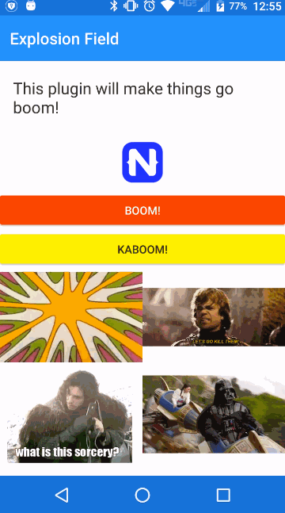

[](https://www.npmjs.com/package/nativescript-explosionfield)
[](https://www.npmjs.com/package/nativescript-explosionfield)
[](https://github.com/bradmartin/nativescript-explosionfield/stargazers)
[](https://www.paypal.me/bradwayne88)


# NativeScript-ExplosionField
NativeScript plugin to create an exploding dust effect animation for Android {N} apps.

[*ExplosionField*](https://github.com/tyrantgit/ExplosionField) - **tyrantgit**

*Android Only*

## Installation 
`npm install nativescript-explosionfield`

## Sample



**This .gif does not do the animation justice, please watch the YouTube video
to see how smooth it really is. [Watch here on YouTube](https://youtu.be/pjFZgDMvioY)**


## Usage

### XML
```XML
<Page xmlns="http://schemas.nativescript.org/tns.xsd" loaded="pageLoaded">
  <StackLayout>
    <Button text="Boom" tap="goBoom" />
    <Label text="Explode This" tap="goBoom" />
  </StackLayout> 
</Page>  
```

### JS
```JS
// require the plugin module
var explosion = require("nativescript-explosionfield");

function goBoom(args) {    
    // call the *explode* method on the plugin passing in a view
    // on tap events in Nativescript this will be args.object.
    explosion.explode(args.object);
}
exports.goBoom = goBoom;
```

### API

**explode(view)**
- executes the animation
